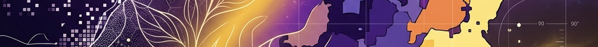
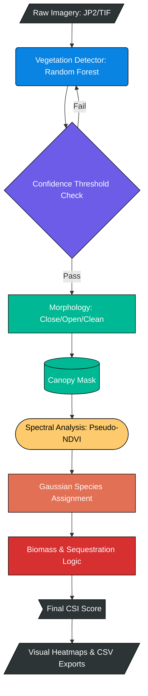
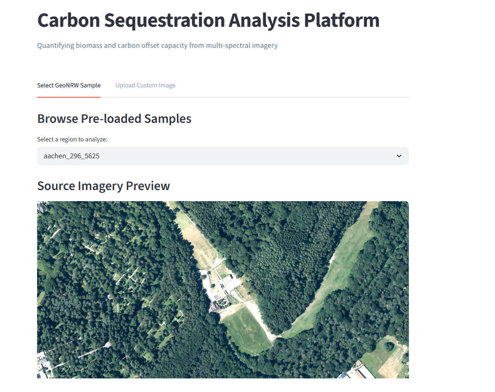
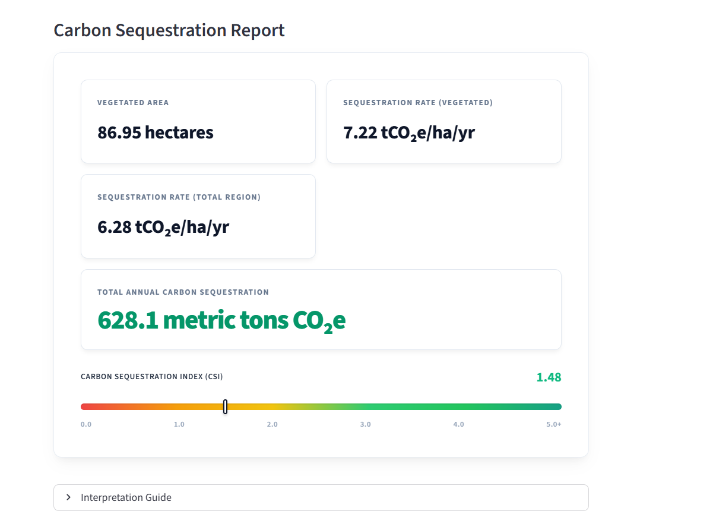
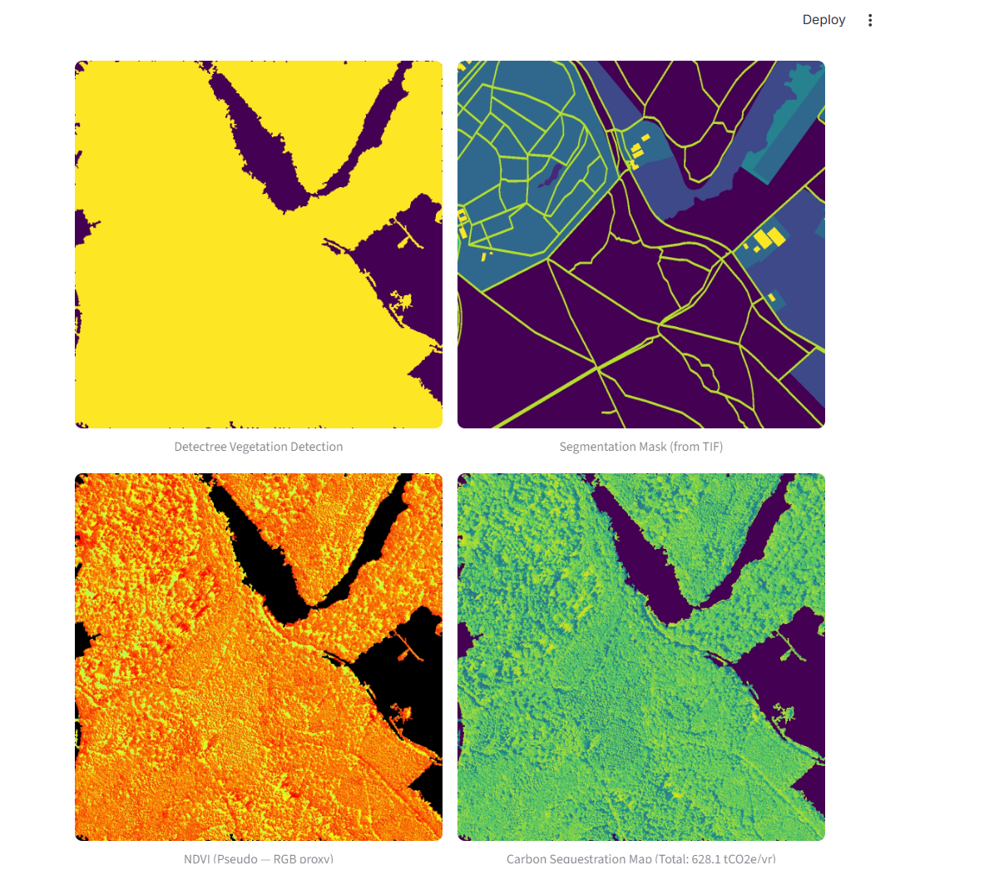

<div align="center">
  

  # Carbon Sequestration Estimator
  
  **Quantifying Urban Carbon Sinks through High-Resolution Satellite Analysis**

  [](https://opensource.org/licenses/MIT)
  [](https://www.python.org/downloads/)
  [](https://streamlit.io/)
  [](https://github.com/aniketqxp/carbon-sequestration-index)

  *Bridging the gap between raw satellite imagery and actionable climate data.*
</div>

---

## Project Overview

Urban green spaces are often unquantified assets in the fight against climate change. The **Carbon Sequestration Estimator** transforms high-resolution aerial imagery (0.1m - 1.0m) into a verified audit of ecological impact. By combining computer vision with probabilistic species modeling, it provides a **Carbon Sequestration Index (CSI)** to help municipalities and developers measure the true value of their green infrastructure.

---

## System Architecture

The workflow integrates geospatial data processing, computer vision, and ecological modeling into a unified pipeline:



---

## Technical Methodology

The platform leverages a multi-stage analytical pipeline to derive carbon estimates from RGB imagery:

### 1. Vegetation Detection
Utilizes a Random Forest classifier (via `detectree`) to segment canopy pixels. A morphological cleanup pass removes sensor noise.

### 2. Spectral Analysis (Pseudo-NDVI)
In the absence of a Near-Infrared (NIR) band, the green channel is used as a proxy for vegetation health:

$$
\text{pseudo-NDVI} = \frac{\text{Green} - \text{Red}}{\text{Green} + \text{Red} + \text{Blue} + \epsilon}
$$

### 3. Carbon Sequestration Index (CSI)
We model sequestration rates across six species using a Gaussian assignment model. The final **Carbon Sequestration Index** is expressed on a logarithmic scale:

$$
\text{CSI} = \log_{10}\left(\frac{C_{\text{t/ha/yr}}}{0.25} + 1\right)
$$

---

## Visual Demonstrations


*Figure 1: Main application interface featuring the region selector, coordinate preview, and analysis parameters.*


*Figure 2: Automated Carbon Sequestration Report featuring the revamped CSI gradient scale and high-fidelity metric cards.*


*Figure 3: Multi-spectral analysis pipeline outputs including vegetation masks, segmentation ground truth, NDVI proxies, and carbon density maps.*

---

## Getting Started

### Prerequisites
- **Python 3.10+**
- **System Dependencies**: GDAL and Rasterio (Required for geospatial processing).

### Installation

```bash
# Clone the repository
git clone https://github.com/aniketqxp/carbon-sequestration-index.git
cd carbon-sequestration-index

# Initialize environment
python -m venv .venv
source .venv/bin/activate  # On Windows: .venv\Scripts\activate

# Install dependencies
pip install -r requirements.txt
```

### Quick Start

Launch the interactive dashboard to analyze sample imagery or upload your own:

```bash
streamlit run app.py
```

Find sample data in the `geonrw_samples/` directory to try the pipeline immediately.

---

## Repository Structure

*   `app.py`: Main Streamlit presentation layer.
*   `src/`: Core scientific packages (Carbon modules, Vegetation detection, Geospatial utilities).
*   `scripts/`: Batch processing and hardware debugging tools.
*   `tests/`: Integration test suite for headless verification.
*   `assets/`: Project branding and UI visuals.

---

## License

Distributed under the **MIT License**. See `LICENSE` for more information.
